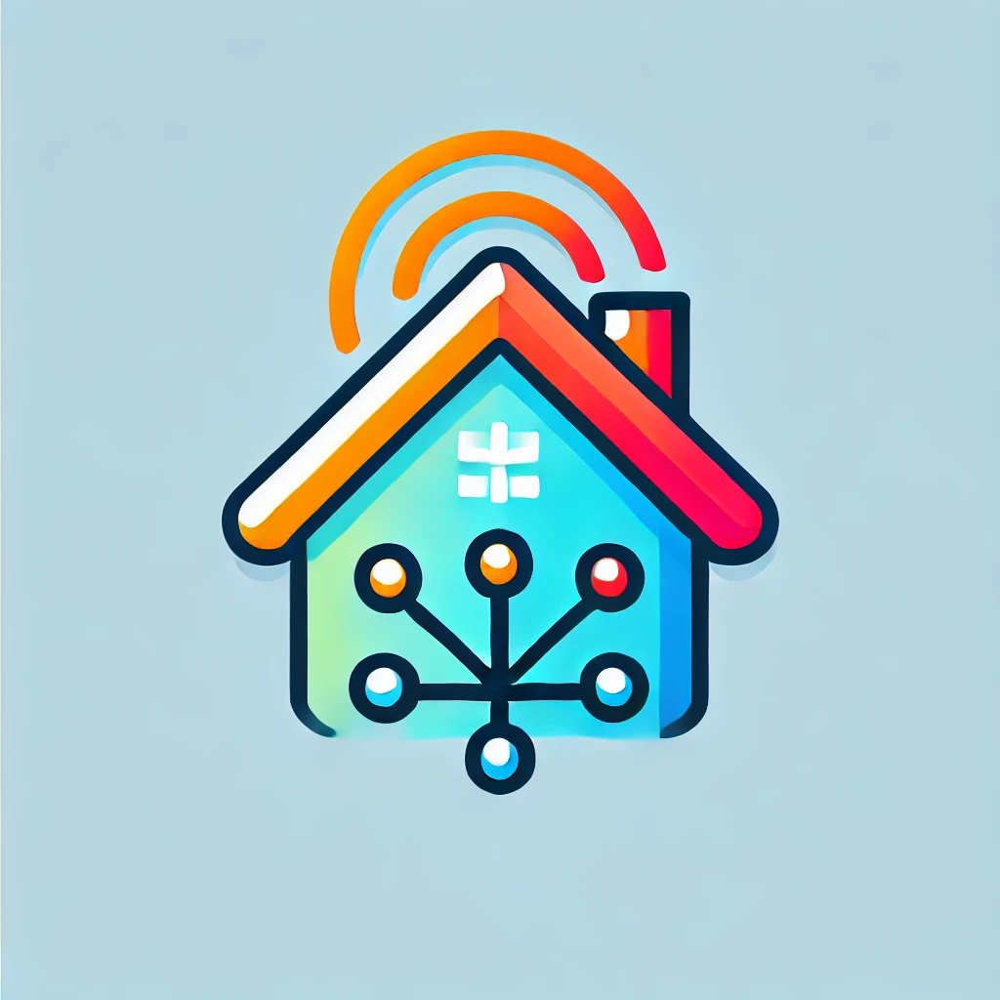

  
# おうちネット

)

## 概要
家庭などでで気軽に使える小規模向けSNSです。
分散型と似ていますがおうちネット同士では投稿を同期しなく、個別でのみデータを保管します。

## アイコン
アイコンはChatGPTが生成しました。
生成に使用したチャットは[こちら](https://chatgpt.com/share/675d4f82-4708-800d-bcc0-b7681e461475)

## セキュリティ面
セキュリティがよわよわです。
セキュリティ面を少しでも強くする内容のブログを後日公開します。

## セットアップ
セットアップ方法は[こちら](SETUP.md)から

## サポート
細かいことでもどうぞ！
全てを無償サポートさせていただきます！
また、このリストは上であれば上であるほど気づきやすく、下であれば下であるほど気づきにくいです。
・[X(旧Twitter)・・・DMまたはメンションで！](https://x.com/webfullsympathy)
・Discord・・・DMで！：@webfullsympathy
・メール・・・そのままOK！件名も適当でOKです！：info@webfullsympathy.com
・[BlueSky・・・DMまたはメンションで！](https://bsky.app/profile/bsky.webfullsympathy.com)
・[ActivePub・・・MisskeyやMastodonのDMまたはメンションで！](https://misskey.io/@webfullsympathy)

