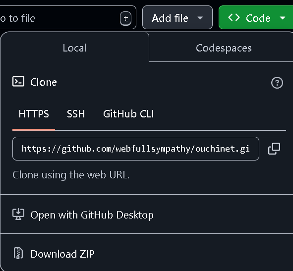

[READMEはこちら](README.md)

# セットアップ
多くのサービスの中からおうちネットの導入ありがとうございます。
まず、導入の方法からです。
# 導入方法

## 必要なサービスの確認
おうちネットでは、PHPを使用しています。(全バージョン)
なのでPHPのインストールが必要です。
PHPをインストールしていない方は[PHPのホームページ](https://www.php.net/downloads.php)からダウンロードしてください。

また、コマンドラインの方法では[Git](https://git-scm.com/downloads)を使用するので事前にダウンロードしておいてください。

そして、おうちネットはウェブアプリのためApacheなどのウェブサーバーソフトウェアが必要になります。

## GUIの方法(初心者などにオススメ)
> [!NOTE]
> これはおうちネットをセットアップしたいサーバーで行ってください。

まず、[GitHub](https://github.com/webfullsympathy/ouchinet)からCodeをクリックしてください。


そして、出てきたメニューの下の方にあるDownload Zipをクリックしてください。



保存先が問われるのでおうちネットを使用したいフォルダを選択してください。<br>
すると、「ouchinet-main.zip」がダウンロードされます。<br>
このZipファイルを何らかのソフトウェアで展開してください。<br>
ほとんどのOSでは標準で展開できます。<br>
それで出来たフォルダの中に「ouchinet-main」というフォルダがあります。<br>
このフォルダがメインとなります。

製作者は実機(Apache2)とXampp3.3.0でしか試していないので環境によるかもしれませんが、<br>
Apacheを前提として話していきます。

まず、Apacheを起動してください。<br>
おうちネットがApacheの動作フォルダにない場合は移動してください。(var/www/htmlなど)<br>
ここまでが分岐地点なので続きの「[導入後](#導入後)」をご覧ください。

## コマンドラインの方法(上級者向け)
> [!NOTE]
> これはおうちネットをセットアップしたいサーバーで行ってください。

最初に、コマンドプロンプト・ターミナル(コマンドライン)を開いてください。

まず、おうちネットを使用したいフォルダにcdで移動してください。

次に、おうちネットのリポジトリをローカルにクローンしてください。
```bash:クローン
git clone https://github.com/webfullsympathy/ouchinet.git
```

製作者は実機(Apache2)とXampp3.3.0でしか試していないので環境によるかもしれませんが、<br>
Apacheを前提として話していきます。

まず、Apacheを起動してください。<br>
おうちネットがApacheの動作フォルダにない場合は移動してください。(var/www/htmlなど)<br>
ここまでが分岐地点なので「[導入後](#導入後)」をご覧ください。

## 導入後
導入が終わりサーバーが起動したらブラウザでアクセスしてください。<br>
```URL
http://localhost
または192.168.x.xなど
```
サーバーのIPが分からない場合は`ipconfig`で確認できます。

アクセスしたらログイン画面に移動されます。

アカウントは事前作成されていないので下の「アカウント作成」をクリックしてください。<br>
その画面でアカウント作成をしてください。

ただし、ユーザー名はadminにしてください。<br>
adminにすることで管理者用設定が出来るようになります。

また、管理者用アカウントはadminのみですのでご了承ください。<br>
サーバーの乗っ取りを防ぐため即座にパスワード変更をご見当ください。
